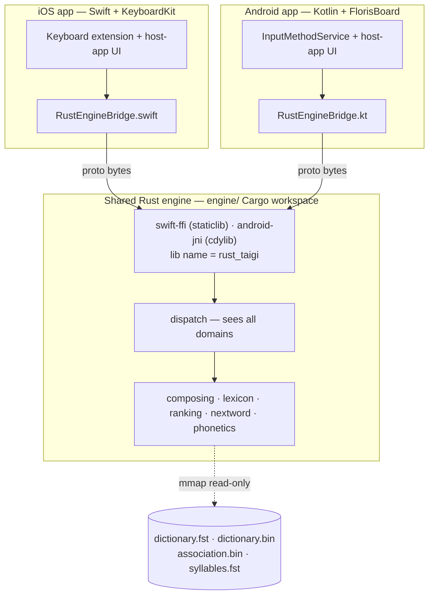
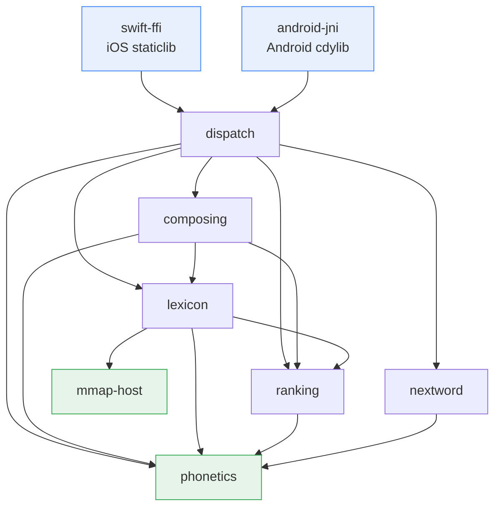
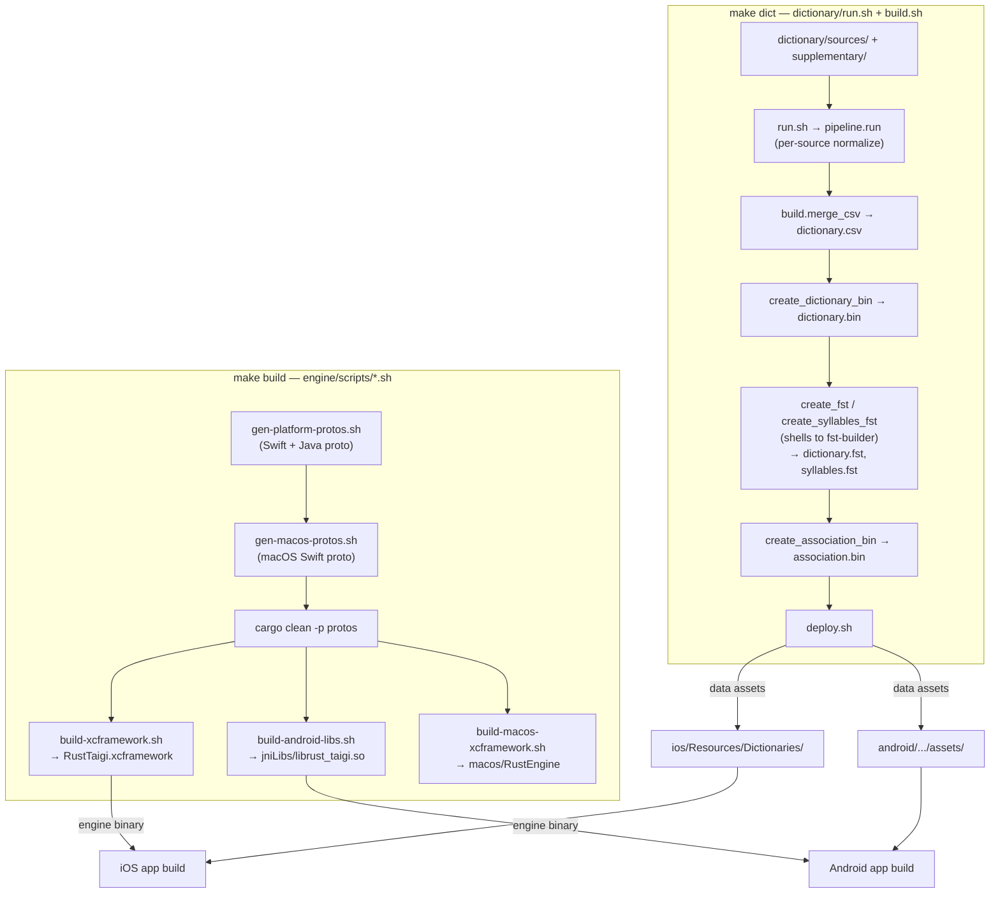
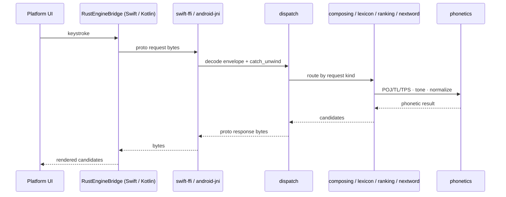

# System Overview (Architecture Diagrams)

> **Type**: Reference
> **Keywords**: `architecture`, `diagram`, `engine`, `FFI`, `build-pipeline`, `data-flow`
> **Related**: file-structure.md, data-artifacts-portability.md, ../engine/rust-core-proto.md

---

## Summary

- Visual architecture map of the cross-platform Taigi Keyboard. Diagrams are the canonical picture; per-file correspondence lives in [`file-structure.md`](file-structure.md), artifact byte layout in [`data-artifacts-portability.md`](data-artifacts-portability.md).
- iOS (Swift + KeyboardKit) and Android (Kotlin + FlorisBoard) are thin platform shells over one shared Rust engine (`engine/` Cargo workspace) reached through a proto bytes-in / bytes-out FFI.
- Diagrams are generated from actual code (crate manifests, `Makefile`, build scripts) — keep them in sync when those change.

---

## 1. System context

Both platforms marshal a proto request to the same Rust engine and render the proto response. The three read-only data artifacts are byte-identical on both platforms and are memory-mapped by the engine.

User-writable state (`user_frequency.db`, `user_association.db`, `custom_dictionary.db`) stays **native** SQLite on each platform (`status=wont_migrate`) — see [`data-artifacts-portability.md`](data-artifacts-portability.md) §4–6.

---

## 2. Engine crate dependency graph

Eleven-member Cargo workspace (`engine/Cargo.toml`). Edges point **caller → callee** (depends on) and flow one way only — the dependency-direction invariant is enforced per `.claude/rules/rust-best-practices.md` §1a.

Omitted from the graph for readability:

- **`protos`** — prost-generated shared message types; **every** crate depends on it (the true leaf).
- **`mmap-host`** — the only crate not under workspace `unsafe_code = "forbid"`; it is the single `unsafe` mmap carve-out, used only by `lexicon`.
- External crates: FFI adapters link `swift-bridge` / `jni`; `lexicon` + `fst-builder` use `fst`; `mmap-host` uses `memmap2`.
- **`build-helpers/fst-builder`** — offline tool (produces `dictionary.fst` / `syllables.fst` at build time), not part of the runtime graph.

Layers: **adapters** (`swift-ffi`, `android-jni`) → **use-case** (`dispatch`) → **domain** (`composing`, `lexicon`, `ranking`, `nextword`) → **leaf kernel** (`phonetics`, `protos`, `mmap-host`).

---

## 3. Build / artifact pipeline

Two independent producers feed each platform app build. The **stale-binary gate** (project `CLAUDE.md` § Build & Test) exists because skipping either producer links the app against old bytes and yields false-green tests.

- `make dict` produces **data artifacts** (~30s) → must precede `make build` when CSV / syllabifier rules change.
- `make build` produces **engine binaries** (~3–5 min, sequential) and bundles the freshest data assets.
- A third generator, `make i18n` (`tools/i18n/generate.py`), turns `i18n/*.json` into committed Kotlin/resource output — see [`i18n-multilang-plan.md`](i18n-multilang-plan.md). Like `make dict`, its output is committed, not a per-compile step.

---

## 4. Request data-flow (one keystroke)

The FFI boundary is a single `process_request_bytes` entrypoint per platform; the proto envelope + per-slice request/response shapes are specified in [`../engine/rust-core-proto.md`](../engine/rust-core-proto.md). Panic / size-cap / generation semantics: [`../engine/ffi-safety.md`](../engine/ffi-safety.md).
