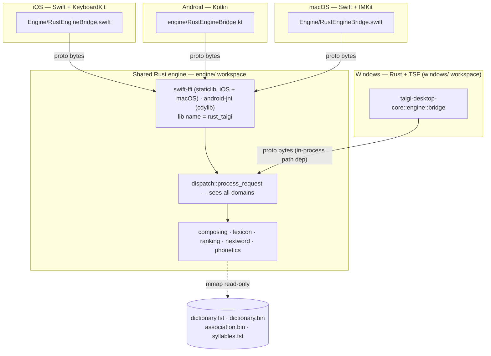
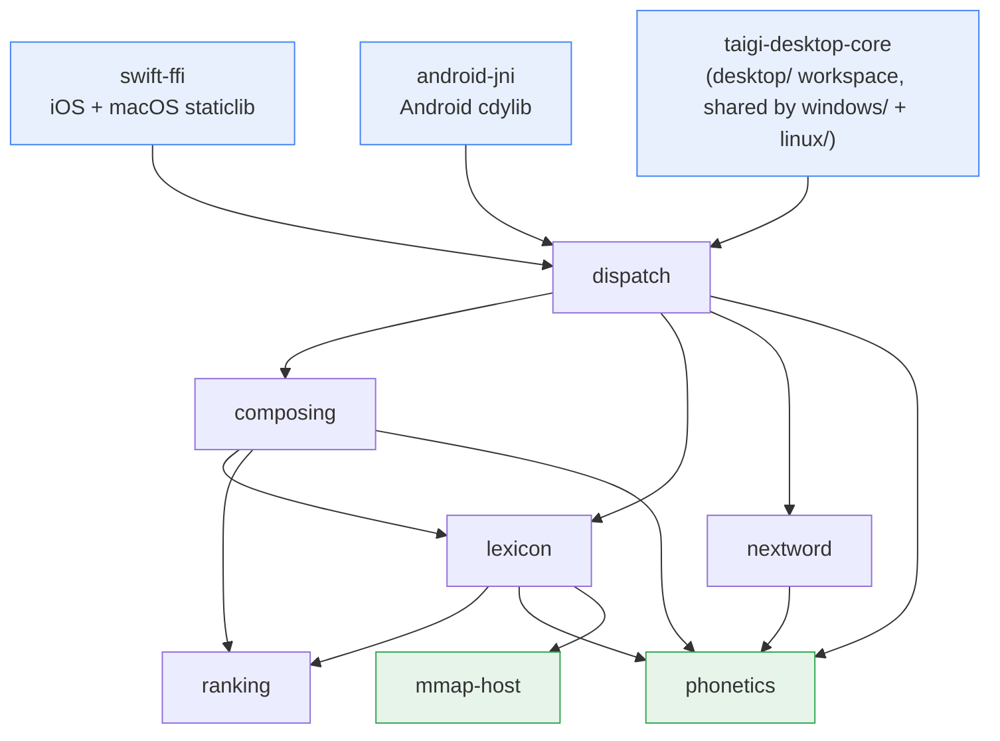
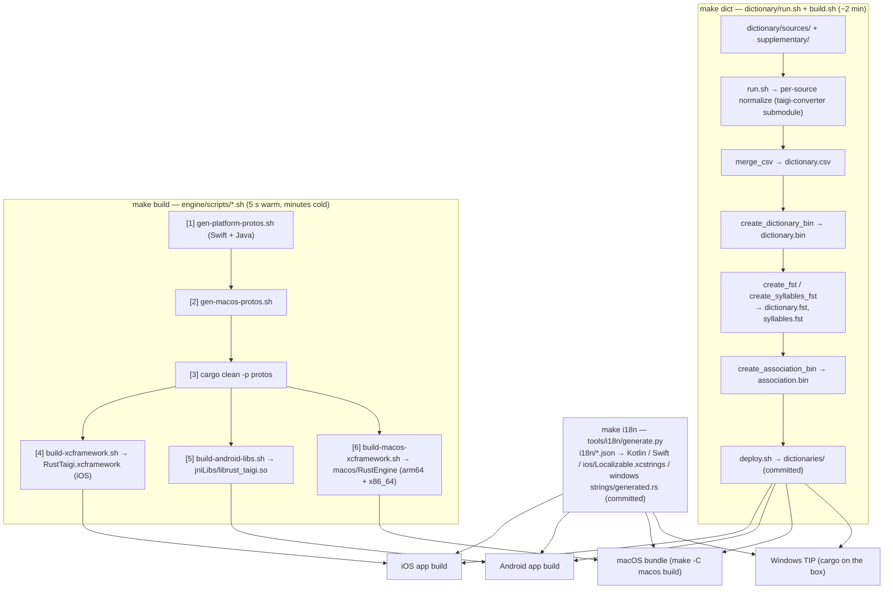
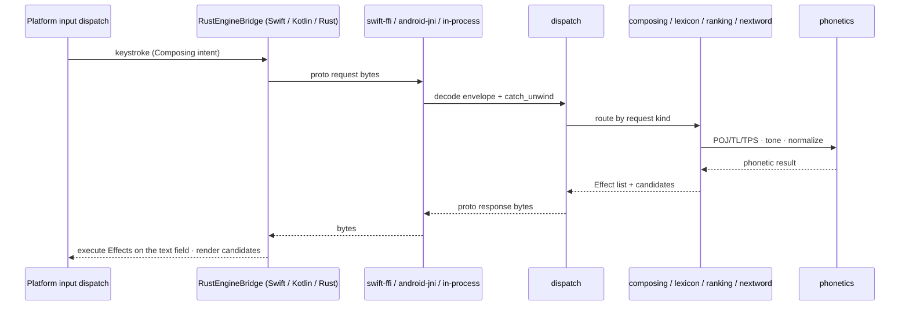

# System Overview (Architecture Diagrams)

> **Type**: Reference — the "read first for architecture" entry point (`CLAUDE.md`)
> **Keywords**: `architecture`, `diagram`, `engine`, `FFI`, `build-pipeline`, `data-flow`, `four platforms`
> **Related**: data-artifacts-portability.md, build-artifacts.md, ../engine/rust-core-proto.md, ../engine/ffi-safety.md

---

## Summary

- Five thin platform shells over one shared Rust engine (`engine/` Cargo workspace), reached through a proto bytes-in / bytes-out boundary: **iOS** (Swift + KeyboardKit), **Android** (Kotlin + FlorisBoard-derived IME), **macOS** (Swift, InputMethodKit), **Windows** (Rust, Text Services Framework — its own `windows/` Cargo workspace consuming the engine crates by path), **Linux** (Fcitx5 addon in C++ over a Rust C ABI + IBus engine in pure Rust, GTK 4 / libadwaita settings window — its own `linux/` workspace over the `desktop/` crates Windows shares).
- Two release trains: mobile (iOS + Android, `mobile-x.y.z`) and desktop (macOS + Windows + Linux, `desktop-x.y.z`). Diagrams are drawn from actual code (crate manifests, `Makefile`, build scripts) — keep them in sync when those change.

---

## 1. System context

Every platform marshals a proto request to the same engine and renders the proto response. The four read-only data artifacts (`dictionaries/`, committed once) are byte-identical across platforms and memory-mapped by the engine.

User-writable state stays **native SQLite on each platform** (`status=wont_migrate`): `user_frequency.db` (schema v2), `user_association.db` (v6, `CROSS-PLATFORM INVARIANT` on all four), `custom_dictionary.db` (v3; Android keeps its own `DATABASE_VERSION` namespace — portability D5), `learned_phrases.db` (§50, own store). iOS/macOS via `SQLite3`, Android via the platform SQLite, Windows and Linux via `rusqlite` in `taigi-desktop-storage`. Details: [`data-artifacts-portability.md`](data-artifacts-portability.md) §4–8.

| Platform | Shell | Engine hop | Candidate UI | Settings UI | Dogfood gate |
|---|---|---|---|---|---|
| iOS | `ios/` keyboard extension (KeyboardKit `ActionHandler`) + host app | `RustEngineBridge+<Area>.swift` → `swift-ffi` | KeyboardKit smartbar + overlays | SwiftUI tabs | Xcode → simulator `81ADB050…` |
| Android | `android/` `TaigiKeyboard : LifecycleInputMethodService` | `RustEngineBridge.kt` + `<Area>Bridge.kt` → `android-jni` | Compose smartbar | Compose activities | `gradlew :app:testDebugUnitTest` |
| macOS | `macos/` SwiftPM `TaigiInputMethodCore` (`TaigiInputController : IMKInputController`) | `RustEngineBridge+<Area>.swift` → `swift-ffi` (universal xcframework) | native `NSPanel` candidate window (roadmap D11) | SwiftUI settings window | `make -C macos test` / `install` |
| Windows | `windows/crates/taigi-windows-tsf` (COM TIP) over `taigi-desktop-core` / `-storage` / `-platform` / `-settings` / `-update` | `taigi-desktop-core::engine` → `dispatch` (path dep, no FFI) | DirectWrite candidate window (`tsf/src/ui/`) | WinUI 3 settings window | `make windows-check` (host) + box build (`windows-release.md`) |
| Linux | `linux/fcitx5` (C++ addon) over `taigi-linux-ffi` (C ABI) and `linux/crates/taigikeyboard-ibus` (zbus), both over `taigi-linux-core` → `taigi-desktop-core` / `-storage` | `taigi-desktop-core::engine` → `dispatch` (path dep; the C ABI is the addon's only FFI) | the framework's panel (Fcitx5 input panel / IBus lookup table) | GTK 4 + libadwaita settings window (`taigikeyboard-settings`) | `make linux-check` (host) + `linux-build.yml` (Ubuntu build, ibus smoke, `.deb`; `linux-release.md`) |

---

## 2. Engine crate dependency graph

Eleven-member Cargo workspace (`engine/Cargo.toml`). Edges point **caller → callee** and flow one way only — the dependency-direction invariant is enforced per `.claude/rules/rust-best-practices.md` §1a. The `desktop/` workspace (the pure crates Windows and Linux share, `linux-roadmap.md` L2) and the `windows/` / `linux/` shell workspaces sit *above* this graph: `taigi-desktop-core` depends on `dispatch` + `protos` by path and is not a member (the shells need `unsafe` for COM; the engine workspace is `unsafe_code = "forbid"`).

Omitted for readability: **`protos`** (prost-generated message types; every crate depends on it — the true leaf); **`mmap-host`** (the single `unsafe` mmap carve-out, used only by `lexicon`); external crates (`swift-bridge` / `jni` in the adapters, `fst` in `lexicon` + `fst-builder`, `memmap2` in `mmap-host`); **`build-helpers/fst-builder`** (offline tool producing `dictionary.fst` / `syllables.fst`). Layers: **adapters** (`swift-ffi`, `android-jni`, `taigi-desktop-core`) → **use-case** (`dispatch`) → **domain** (`composing`, `lexicon`, `ranking`, `nextword`) → **leaf kernel** (`phonetics`, `protos`, `mmap-host`).

---

## 3. Build / artifact pipeline

Three generators feed the platform builds; only `make dict` and `make i18n` output is committed. The **stale-artifact gate** (`CLAUDE.md` § Build & Test) exists because skipping a producer links the app against old bytes and yields false-green tests. Rationale, what is gitignored, and timings: [`build-artifacts.md`](build-artifacts.md).

- Windows needs no `make build` step: the TIP compiles the engine crates in-process (`windows/Cargo.toml` path deps). `make windows-check` is the host-side gate (i18n check + native tests for the pure crates + clippy against `x86_64-pc-windows-gnu` + `cargo check` on `-msvc`); the DLL itself builds only on the Windows box.
- `make dict` must finish before `make build` when dictionary sources or syllabifier rules moved; `/release-mobile` and `/release-desktop` rerun `make i18n` + `make build` themselves.

---

## 4. Request data-flow (one keystroke)

Every platform runs the same loop: **input dispatch → composing (engine) → candidate fetch (engine) → display → selection → commit + learning**. The engine owns the state machine and the ranking; the platform owns the text-field binding, the candidate surface, the timers and the SQLite stores.

The FFI boundary is a single `process_request_bytes` entrypoint per adapter; the proto envelope + per-slice request/response shapes are in [`../engine/rust-core-proto.md`](../engine/rust-core-proto.md); panic / size-cap / generation semantics in [`../engine/ffi-safety.md`](../engine/ffi-safety.md). Composing state machine contract: [`composing-state-boundary.md`](composing-state-boundary.md); next-word contract: [`nextword-engine-boundary.md`](nextword-engine-boundary.md).

### 4.1 iOS glue chain (the exemplar; `ios-exemplar.md`)

| Step | iOS file | Engine crate |
|---|---|---|
| Input dispatch | `Actions/ActionHandler.swift` (+ `+KeyActions`, `+CustomActions`): case conversion by `keyboardCase`; punctuation confirms the composition first; letters / digits enter composing | — |
| Composing wrapper | `Input/Composing/ComposingManager.swift` + `ComposingDelegate.swift` (three-phase apply of the engine `Effect` list onto `UITextDocumentProxy`; `rawInput` / `composingText` snapshot) | `engine/composing` |
| Candidate fetch | `Autocomplete/Services/TaigiAutocompleteService.swift` — continuous `FetchAtPos` (engine-only since v3.5.8) → `transformSuggestion` case pass | `engine/composing` → `engine/lexicon::continuous` (dedup + sort) → `engine/ranking` (score, user weight) |
| Bridge | `Engine/RustEngineBridge.swift` + `RustEngineBridge+{Composing,Lexicon,Phonetics,CaseTransform,NextWord}.swift`; `SwiftLoggerSink.swift`, `RustVec+UInt8.swift` | `engine/dispatch` via `engine/swift-ffi` |
| Display | KeyboardKit smartbar; `Autocomplete/Views/CandidateButtonView.swift`; overlays `Overlays/{Symbol,Settings,Layout}SelectionOverlay.swift`, `ExpandedCandidateOverlay.swift` | — |
| Selection | `Actions/ActionHandler+Suggestions.swift` → `ComposingManager.selectSuggestion()` → frequency record → NextWord intent | `engine/composing` (`CommitContinuous`) |
| NextWord glue | `NextWord/NextWordController.swift` (timer, `@MainActor`, generation counter) + `NextWord/Services/NextWordService.swift` (SQLite) | `engine/nextword` (`decide`, filter) + `engine/dispatch` `PredictNext` (bundled lookup) via `nextwordPredictNext` |
| Settings | `Settings/SharedSettings.swift` + `SettingsKey.swift` (live-read `EngineSettingsProvider`) | `AppConfig` per request |

Engine search ownership on the fetch step: `lexicon::key_normalizer` (calls `phonetics::normalize_input`) → `lexicon::prefix_index::PrefixIndex` (fst scan) → `lexicon::dictionary_reader::DictionaryReader` + `Filter` (rowid → record, source bitmask) → `lexicon::continuous` sort key (`ranking` score + user weight).

### 4.2 Same chain on the other platforms

| Step | Android | macOS | Windows |
|---|---|---|---|
| Input dispatch | `ime/text/TextInputManager.kt`, `CharacterInputPipeline.kt` | `Controller/TaigiInputController.swift` + `ComposingKeyIntent.swift` (key table) | `tsf/src/session.rs::run_key` + `key_translation.rs` |
| Composing wrapper | `ime/text/composing/ComposingManager.kt` + `ComposingDelegate.kt` (`InputConnection` binding, `composing-state-boundary.md` §11) | `Composing/ComposingManager.swift` + `ComposingSessionCoordinator.swift` (one owner, generation tokens) + `ClientEffectExecutor.swift` | `taigi-desktop-core::composing` coordinator + `tsf/src/composition.rs` / `edit_session.rs` |
| Candidate fetch | `ime/text/composing/TaigiAutocompleteService.kt`; `LexiconService.kt` for the dictionary tab only | `Engine/RustEngineBridge+Lexicon.swift` | `taigi-desktop-core::engine::lexicon` |
| Display | `ime/text/smartbar/` (Compose smartbar, `CandidateStripState.kt`) | `Candidates/` (`CandidatePresenter` seam, horizontal / vertical / expandable panels) | `tsf/src/ui/candidate_window.rs`, `candidate_list_element.rs`, `render.rs` |
| Selection | `ime/text/smartbar/CandidateClickHandler.kt` | slot keys (`CandidateSlotKeySet`) + Space | slot keys + Space |
| NextWord glue | `ime/text/smartbar/NextWordController.kt` + `ime/dictionary/NextWordService.kt` | `NextWord/NextWordLearner.swift` (write-and-rank, no prediction surface — roadmap D7) | `taigi-desktop-core::engine::nextword` + `taigi-desktop-storage::association` |
| Settings | `ime/core/PrefHelper.kt` (DataStore) + `ime/core/settings/EngineSettings.kt` | `Settings/SettingsStore.swift` (UserDefaults) | `taigi-desktop-core::settings` (`keys.rs`) + `taigi-desktop-storage::settings_file` |

State machine on every platform: `[Idle] ─ input ─▶ [Composing]`, leaving via candidate select / Space / Enter / delete-to-empty; semantics pinned in `behavioral-invariants.md` §13.

---

## 5. Where to read next

- Cross-platform contract: `behavioral-invariants.md` · glue shape (layers, DI, live-read settings): `ios-exemplar.md` (+ §9 Android deviations) · composing / next-word bindings: `composing-state-boundary.md`, `nextword-engine-boundary.md`.
- Engine wire: `../engine/rust-core-proto.md`, `../engine/ffi-safety.md` · desktop design records: `macos-roadmap.md`, `windows-roadmap.md`.
- Releasing: `desktop-release.md` (entry), `macos-release.md`, `windows-release.md`, `manual-release-notes.md` · device acceptance: `dogfood-checklist.md`.
