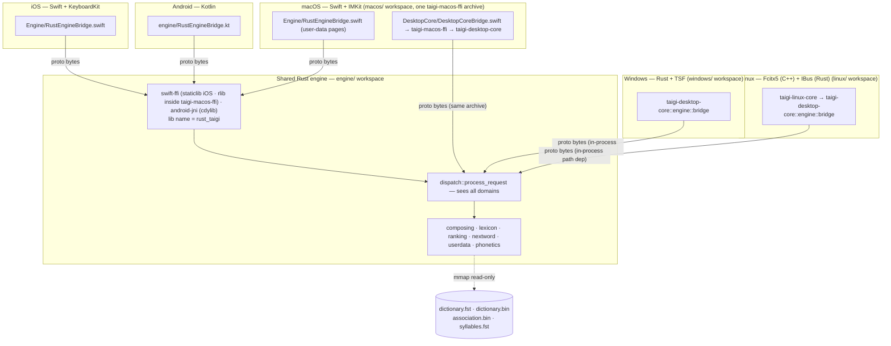
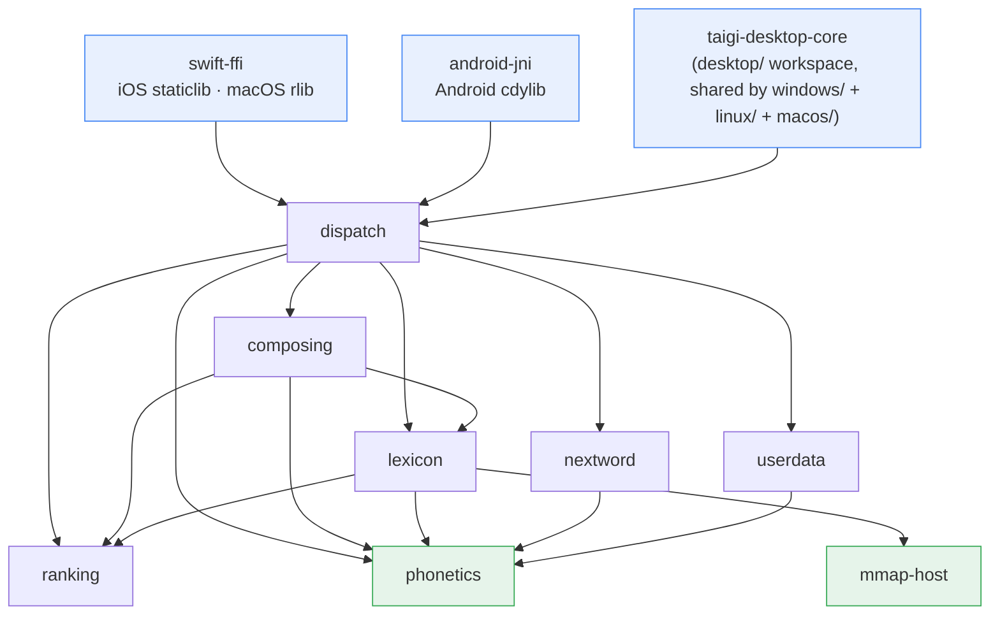
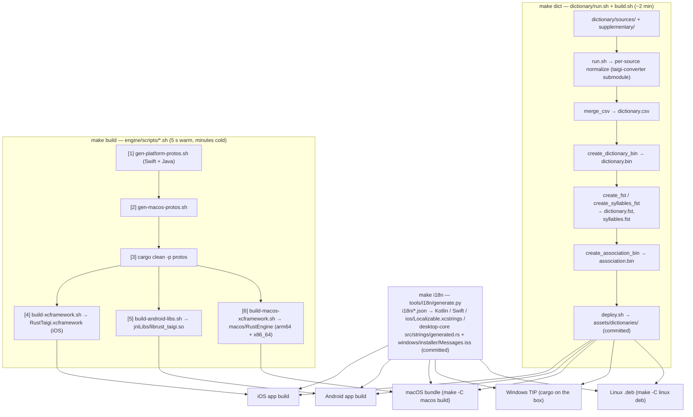
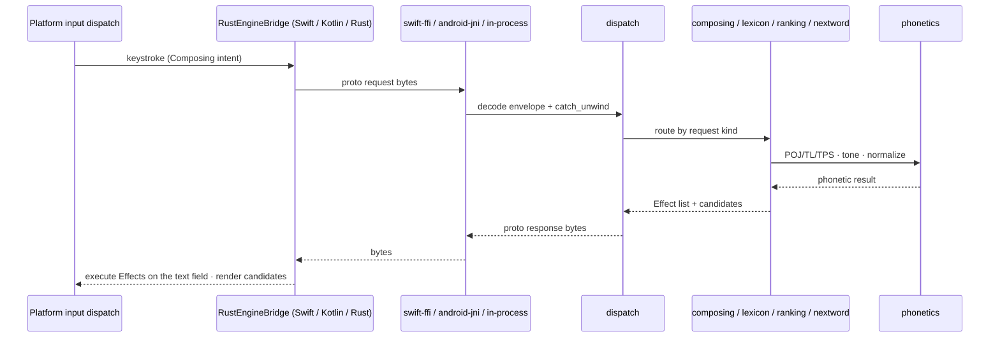

# System Overview (Architecture Diagrams)

> **Type**: Reference — the "read first for architecture" entry point (`AGENTS.md`)
> **Keywords**: `architecture`, `diagram`, `engine`, `FFI`, `build-pipeline`, `data-flow`, `five platforms`
> **Related**: data-artifacts-portability.md, build-artifacts.md, ../engine/rust-core-proto.md, ../contributing/rust-ffi-safety.md

---

## Summary

- Five thin platform shells over one shared Rust engine (`engine/` Cargo workspace), reached through a proto bytes-in / bytes-out boundary: **iOS** (Swift + KeyboardKit), **Android** (Kotlin + FlorisBoard-derived IME), **macOS** (Swift, InputMethodKit — its key path runs in `taigi-desktop-core` through one static library from its own `macos/` workspace, `taigi-macos-ffi`), **Windows** (Rust, Text Services Framework — its own `windows/` Cargo workspace consuming the engine crates by path), **Linux** (Fcitx5 addon in C++ over a Rust C ABI + IBus engine in pure Rust, GTK 4 / libadwaita settings window — its own `linux/` workspace over the `desktop/` crates Windows shares).
- Two release trains: mobile (iOS + Android, `mobile-x.y.z`) and desktop (macOS + Windows + Linux, `desktop-x.y.z`). Diagrams are drawn from actual code (crate manifests, `Makefile`, build scripts) — keep them in sync when those change.

---

## 1. System context

Every platform marshals a proto request to the same engine and renders the proto response. The four read-only data artifacts (`assets/dictionaries/`, committed once) are byte-identical across platforms and memory-mapped by the engine.

```mermaid
graph TB
    subgraph iOS["iOS — Swift + KeyboardKit"]
        iosBridge["Engine/RustEngineBridge.swift"]
    end
    subgraph Android["Android — Kotlin"]
        andBridge["engine/RustEngineBridge.kt"]
    end
    subgraph macOS["macOS — Swift + IMKit (macos/ workspace, one taigi-macos-ffi archive)"]
        macCore["DesktopCore/DesktopCoreBridge.swift → taigi-macos-ffi → taigi-desktop-core"]
        macBridge["Engine/RustEngineBridge.swift (user-data pages)"]
    end
    subgraph Windows["Windows — Rust + TSF (windows/ workspace)"]
        winBridge["taigi-desktop-core::engine::bridge"]
    end
    subgraph Linux["Linux — Fcitx5 (C++) + IBus (Rust) (linux/ workspace)"]
        linBridge["taigi-linux-core → taigi-desktop-core::engine::bridge"]
    end
    subgraph Engine["Shared Rust engine — engine/ workspace"]
        ffi["swift-ffi (staticlib iOS · rlib inside taigi-macos-ffi) · android-jni (cdylib)<br/>lib name = rust_taigi"]
        dispatch["dispatch::process_request — sees all domains"]
        domains["composing · lexicon · ranking · nextword · userdata · phonetics"]
        ffi --> dispatch --> domains
    end
    artifacts[("dictionary.fst · dictionary.bin<br/>association.bin · syllables.fst")]

    iosBridge -->|proto bytes| ffi
    andBridge -->|proto bytes| ffi
    macBridge -->|proto bytes| ffi
    macCore -->|"proto bytes (same archive)"| dispatch
    winBridge -->|"proto bytes (in-process path dep)"| dispatch
    linBridge -->|"proto bytes (in-process path dep)"| dispatch
    domains -. mmap read-only .-> artifacts
```

User-writable state is four SQLite files, **owned by the engine crate `userdata`** on every platform (`rusqlite`, [`user-data-engine-roadmap.md`](user-data-engine-roadmap.md) P5–P9): `user_frequency.db` (schema v2), `user_association.db` (v6), `custom_dictionary.db` (stamped ≥ 4; the engine takes over every released platform shape by shape — portability D5, resolved), `learned_phrases.db` (§50, own store). The platforms name the files and send the picks; the engine reads, ranks and writes. Details: [`data-artifacts-portability.md`](data-artifacts-portability.md) §4–8.

| Platform | Shell | Engine hop | Candidate UI | Settings UI | Dogfood gate |
|---|---|---|---|---|---|
| iOS | `ios/` keyboard extension (KeyboardKit `ActionHandler`) + host app | `RustEngineBridge+<Area>.swift` → `swift-ffi` | KeyboardKit smartbar + overlays | SwiftUI tabs | Xcode → simulator (`AGENTS.md` § Build & Test) |
| Android | `android/` `TaigiKeyboard : LifecycleInputMethodService` | `RustEngineBridge.kt` + `<Area>Bridge.kt` → `android-jni` | Compose smartbar | Compose activities | `gradlew :app:testDebugUnitTest` |
| macOS | `macos/` SwiftPM `TaigiInputMethodCore` (`TaigiInputController : IMKInputController`) | key path: `DesktopCore/DesktopCoreBridge.swift` → `taigi-macos-ffi` (`desktop_request_bytes`) → `taigi-desktop-core` → `dispatch`; user-data pages: `RustEngineBridge+UserData.swift` → the `swift-ffi` seam in the same archive (universal xcframework) | native `NSPanel` candidate window (roadmap D11) | SwiftUI settings window | `make -C macos test` / `install` |
| Windows | `windows/crates/taigi-windows-tsf` (COM TIP) over `taigi-desktop-core` / `-storage` / `-platform` / `-settings` / `-update` | `taigi-desktop-core::engine` → `dispatch` (path dep, no FFI) | DirectWrite candidate window (`tsf/src/ui/`) | WinUI 3 settings window | `make windows-check` (host) + box build (`windows-release.md`) |
| Linux | `linux/fcitx5` (C++ addon) over `taigi-linux-ffi` (C ABI) and `linux/crates/taigikeyboard-ibus` (zbus), both over `taigi-linux-core` → `taigi-desktop-core` / `-storage` | `taigi-desktop-core::engine` → `dispatch` (path dep; the C ABI is the addon's only FFI) | the framework's panel (Fcitx5 input panel / IBus lookup table) | GTK 4 + libadwaita settings window (`taigikeyboard-settings`) | `make linux-check` (host) + `linux-build.yml` (Ubuntu build, ibus smoke, `.deb`; `linux-release.md`) |

---

## 2. Engine crate dependency graph

Thirteen-member Cargo workspace (`engine/Cargo.toml`). Edges point **caller → callee** and flow one way only — the dependency-direction invariant is enforced per `docs/contributing/rust-best-practices.md` §1a. The `desktop/` workspace (the pure crates the three desktops share, `linux-roadmap.md` L2, `macos-desktop-core-roadmap.md`) and the `windows/` / `linux/` / `macos/` shell workspaces sit *above* this graph: `taigi-desktop-core` depends on `dispatch` + `protos` by path and is not a member (the engine workspace pins the Apple / Android targets and is the engine's dependency-direction boundary; `desktop/Cargo.toml` is `unsafe_code = "forbid"` too — only the `windows/` / `linux/` shell workspaces override it for COM / C ABI; `macos/` keeps `forbid` — its seam is swift-bridge bytes, no `unsafe`).

```mermaid
graph TD
    swiftffi["swift-ffi<br/>iOS staticlib · macOS rlib"] --> dispatch
    androidjni["android-jni<br/>Android cdylib"] --> dispatch
    wincore["taigi-desktop-core<br/>(desktop/ workspace, shared by windows/ + linux/ + macos/)"] --> dispatch
    dispatch --> composing
    dispatch --> lexicon
    dispatch --> nextword
    dispatch --> ranking
    dispatch --> userdata
    dispatch --> phonetics
    composing --> lexicon
    composing --> ranking
    composing --> phonetics
    lexicon --> ranking
    lexicon --> phonetics
    lexicon --> mmaphost["mmap-host"]
    nextword --> phonetics
    userdata --> phonetics

    classDef adapter fill:#e8f0fe,stroke:#4285f4;
    classDef leaf fill:#e6f4ea,stroke:#34a853;
    class swiftffi,androidjni,wincore adapter;
    class phonetics,mmaphost leaf;
```

Omitted for readability: **`protos`** (prost-generated message types; every crate depends on it — the true leaf); **`mmap-host`** (the single `unsafe` mmap carve-out, used only by `lexicon`); external crates (`swift-bridge` / `jni` in the adapters, `fst` in `lexicon` + `fst-builder`, `memmap2` in `mmap-host`, `rusqlite` (bundled SQLite) in `userdata`, which only `dispatch/user-data` pulls in — `taigi-desktop-core` reaches the stores only through `dispatch`'s user-data ops, so a build that leaves `dispatch/user-data` off stays C-free; `taigi-desktop-storage` (settings file, fonts, directory) sits beside `desktop-core` with no engine edge of its own); **`build-helpers/fst-builder`** (offline tool producing `dictionary.fst` / `syllables.fst`); **`test-support`** (dev-dependency shared by the engine crates' tests; no engine edge). Layers: **adapters** (`swift-ffi`, `android-jni`, `taigi-desktop-core`) → **use-case** (`dispatch`) → **domain** (`composing`, `lexicon`, `ranking`, `nextword`, `userdata`) → **leaf kernel** (`phonetics`, `protos`, `mmap-host`). `dispatch/src/trace.rs` is the test-build-only JSONL trace behind the `e2e-trace` feature ([`e2e-trace-schema.md`](e2e-trace-schema.md)).

Crates above the graph: `desktop/` = `taigi-desktop-core` (engine bridge, composing coordinator + intent executor, keys, settings model, strings), `taigi-desktop-storage` (settings file + writer, fonts, data directory) and `taigi-desktop-update` (update check, Windows only today); `macos/crates/` = `taigi-macos-ffi` (the one static library the Mac links: `swift-ffi` as an rlib plus the desktop shell seam `desktop_request_bytes` over `taigi-desktop-core`); `windows/crates/` = `taigi-windows-tsf` (COM TIP), `taigi-windows-platform` (Win32 helpers), `taigi-windows-settings` (WinUI 3 window), `taigi-windows-update` (installer download + verify); `linux/crates/` = `taigi-linux-core` (session, executor, chrome), `taigi-linux-platform` (XDG paths, key translation, locale, launcher), `taigi-linux-ffi` (Fcitx5 C ABI), `taigikeyboard-ibus`, `taigikeyboard-settings`. Other trees: `e2e/` (end-to-end scenarios, analyzer, drivers), `emoji/` (own `CLAUDE.md`), `assets/` (dictionaries, fonts, symbols), `windows/installer/`, `linux/packaging/`, `macos/updates/`, `tools/release/stage-desktop.sh`.

---

## 3. Build / artifact pipeline

Three generators feed the platform builds; only `make dict` and `make i18n` output is committed. The **stale-artifact gate** (`AGENTS.md` § Build & Test) exists because skipping a producer links the app against old bytes and yields false-green tests. Rationale, what is gitignored, and timings: [`build-artifacts.md`](build-artifacts.md).

```mermaid
flowchart TD
    subgraph dictpipe["make dict — dictionary/run.sh + build.sh (~2 min)"]
        direction TB
        src["dictionary/sources/ + supplementary/"] --> pipe["run.sh → per-source normalize (taigi-converter submodule)"]
        pipe --> merge["merge_csv → dictionary.csv"] --> binw["create_dictionary_bin → dictionary.bin"]
        binw --> fstw["create_fst / create_syllables_fst<br/>→ dictionary.fst, syllables.fst"] --> assoc["create_association_bin → association.bin"]
        assoc --> dep["deploy.sh → assets/dictionaries/ (committed)"]
    end
    subgraph buildpipe["make build — engine/scripts/*.sh (5 s warm, minutes cold)"]
        direction TB
        proto["[1] gen-platform-protos.sh (Swift + Java)"] --> mproto["[2] gen-macos-protos.sh"] --> clean["[3] cargo clean -p protos"]
        clean --> xcf["[4] build-xcframework.sh → RustTaigi.xcframework (iOS)"]
        clean --> jnib["[5] build-android-libs.sh → jniLibs/librust_taigi.so"]
        clean --> mxcf["[6] build-macos-xcframework.sh → macos/RustEngine (arm64 + x86_64)"]
    end
    i18n["make i18n — tools/i18n/generate.py<br/>i18n/*.json → Kotlin / Swift / ios/Localizable.xcstrings /<br/>desktop-core src/strings/generated.rs + windows/installer/Messages.iss (committed)"]

    dep --> iosApp["iOS app build"] & andApp["Android app build"] & macApp["macOS bundle (make -C macos build)"] & winApp["Windows TIP (cargo on the box)"] & linApp["Linux .deb (make -C linux deb)"]
    xcf --> iosApp
    jnib --> andApp
    mxcf --> macApp
    i18n --> iosApp & andApp & macApp & winApp & linApp
```

- Windows and Linux need no `make build` step: both compile the engine crates in-process (`windows/Cargo.toml` / `linux/Cargo.toml` path deps). `make linux-check` is Linux's host gate; the `.deb` is `make -C linux deb` (`linux-release.md`). `make windows-check` is the host-side gate (i18n check + native tests for the pure crates + clippy against `x86_64-pc-windows-gnu` + `cargo check` on `-msvc`); the DLL itself builds only on the Windows box.
- `make dict` must finish before `make build` when dictionary sources or syllabifier rules moved; `/release-mobile` and `/release-desktop` rerun `make i18n` + `make build` themselves.

---

## 4. Request data-flow (one keystroke)

Every platform runs the same loop: **input dispatch → composing (engine) → candidate fetch (engine) → display → selection → commit + learning**. The engine owns the state machine and the ranking; the platform owns the text-field binding, the candidate surface and the timers; the engine owns the user's data too.

```mermaid
sequenceDiagram
    participant UI as Platform input dispatch
    participant Bridge as RustEngineBridge (Swift / Kotlin / Rust)
    participant FFI as swift-ffi / android-jni / in-process
    participant D as dispatch
    participant Dom as composing / lexicon / ranking / nextword
    participant Ph as phonetics

    UI->>Bridge: keystroke (Composing intent)
    Bridge->>FFI: proto request bytes
    FFI->>D: decode envelope + catch_unwind
    D->>Dom: route by request kind
    Dom->>Ph: POJ/TL/TPS · tone · normalize
    Ph-->>Dom: phonetic result
    Dom-->>D: Effect list + candidates
    D-->>FFI: proto response bytes
    FFI-->>Bridge: bytes
    Bridge-->>UI: execute Effects on the text field · render candidates
```

The FFI boundary is a single `process_request_bytes` entrypoint per adapter; the proto envelope + per-slice request/response shapes are in [`../engine/rust-core-proto.md`](../engine/rust-core-proto.md); panic / size-cap / generation semantics in [`../contributing/rust-ffi-safety.md`](../contributing/rust-ffi-safety.md). Composing state machine contract: [`composing-state-boundary.md`](composing-state-boundary.md); next-word contract: [`nextword-engine-boundary.md`](nextword-engine-boundary.md).

### 4.1 iOS glue chain (the exemplar; `ios-exemplar.md`)

| Step | iOS file | Engine crate |
|---|---|---|
| Input dispatch | `Actions/ActionHandler.swift` (+ `+KeyActions`, `+CustomActions`): case conversion by `keyboardCase`; punctuation confirms the composition first; letters / digits enter composing | — |
| Composing wrapper | `Input/Composing/ComposingManager.swift` + `ComposingDelegate.swift` (three-phase apply of the engine `Effect` list onto `UITextDocumentProxy`; `rawInput` / `composingText` snapshot) | `engine/composing` |
| Candidate fetch | `Candidates/Services/TaigiAutocompleteService.swift` — continuous `FetchAtPos` (engine-only since v3.5.8; candidates arrive cased) | `engine/composing` → `engine/lexicon::continuous` (dedup + sort) → `engine/ranking` (score, user weight) |
| Bridge | `Engine/RustEngineBridge.swift` + `RustEngineBridge+{Composing,Lexicon,Phonetics,CaseTransform,NextWord,UserData}.swift`; `UserDataOpening.swift`, `SwiftLoggerSink.swift`, `RustVec+UInt8.swift` | `engine/dispatch` via `engine/swift-ffi` |
| Display | KeyboardKit smartbar; `Candidates/Views/CandidateButtonView.swift`; overlays `Overlays/{Symbol,Settings,Layout}SelectionOverlay.swift`, `ExpandedCandidateOverlay.swift` | — |
| Selection | `Actions/ActionHandler+Suggestions.swift` → `ComposingManager.commitContinuous(…)` → frequency record → NextWord intent | `engine/composing` (`CommitContinuous`) |
| NextWord glue | `NextWord/NextWordController.swift` (timer, `@MainActor`, generation counter; the engine reads and writes `user_association.db` itself) | `engine/nextword` (`decide`, filter) + `engine/dispatch` `PredictNext` (bundled lookup) via `nextwordPredictNext` |
| Settings | `Settings/SharedSettings.swift` + `SettingsKey.swift` (live-read `EngineSettingsProvider`) | `AppConfig` per request |

Engine search ownership on the fetch step: `phonetics::KeyFamily::search_key` (calls `phonetics::normalize_input`) → `lexicon::prefix_index::PrefixIndex` (fst scan) → `lexicon::dictionary_reader::DictionaryReader` + `Filter` (rowid → record, source bitmask) → `ranking::CandidateSortKey` order (`ranking` score + user weight).

### 4.2 Same chain on the other platforms

| Step | Android | macOS | Windows | Linux |
|---|---|---|---|---|
| Input dispatch | `ime/text/TextInputManager.kt`, `CharacterInputPipeline.kt` | `Controller/TaigiInputController.swift` → `Composing/ComposingBackend.swift` → `taigi-macos-ffi` `session.rs` + `key_translation.rs` → the same `perform_intent` | `tsf/src/session.rs::run_key` + `key_translation.rs` → `taigi-desktop-core::composing::perform_intent` (`intent_executor.rs`) | `taigi-linux-core::session` + `taigi-linux-platform::key_translation` → the same `perform_intent` |
| Composing wrapper | `ime/text/composing/ComposingManager.kt` + `ComposingDelegate.kt` (`InputConnection` binding, `composing-state-boundary.md` §11) | `taigi-desktop-core::composing` coordinator over the shell seam; Swift keeps `ComposingSessionCoordinator.swift` (one owner, session tokens) + `ClientWriter.swift` (writes marked / committed text into the IMK client; `TaigiInputController.replay` replays the recorded effects) | `taigi-desktop-core::composing` coordinator + `tsf/src/composition.rs` / `edit_session.rs` | `taigi-desktop-core::composing` coordinator + `taigi-linux-core::executor` (effects replayed as IBus / Fcitx5 signals) |
| Candidate fetch | `ime/text/candidates/TaigiAutocompleteService.kt`; `LexiconService.kt` for the dictionary tab only | same as Windows | `taigi-desktop-core::engine::lexicon` | same as Windows |
| Display | `ime/text/candidates/` (`CandidateStrip.kt`, `CandidateStripState.kt`), `ime/text/overlays/`, `ime/text/smartbar/` (Compose smartbar host) | `Candidates/` (`CandidatePresenter` seam, horizontal / vertical / expandable panels) | `tsf/src/ui/candidate_window.rs`, `candidate_list_element.rs`, `render.rs` | the framework's panel; `taigi-linux-core::selection` pages it |
| Selection | `ime/text/candidates/CandidateClickHandler.kt` | slot keys + Space | slot keys + Space | slot keys + Space |
| NextWord glue | `ime/text/nextword/NextWordController.kt` | same as Windows (write-and-rank, no prediction surface on any desktop) | `taigi-desktop-core::composing::next_word` + `engine::nextword` (the engine records into `user_association.db`) | same as Windows |
| Settings | `ime/settings/PrefHelper.kt` (DataStore) + `ime/settings/EngineSettings.kt` | `Settings/SettingsStore.swift` (UserDefaults); each request carries the key-path settings as a snapshot (`taigi-macos-ffi` `settings.rs`) | `taigi-desktop-core::settings` (`keys.rs`) + `taigi-desktop-storage::settings_file` | same as Windows; paths from `taigi-linux-platform::paths` (XDG) |

State machine on every platform: the engine's `composing::api::Phase` is `Idle` / `Continuous { raw, caret, nailed, conversion }` (`engine/composing/src/api.rs`). Input leaves `Idle`; candidate select / Space / Enter / delete-to-empty return to it; semantics pinned in `behavioral-invariants.md` §13.

### Desktop keyboard layouts

General settings exposes **Keyboard Layout**: QWERTY (default), Dvorak, or
Colemak for TL/POJ. The macOS shell stores `keyboardLayout` in `UserDefaults`
and calls `IMKTextInput.overrideKeyboard(withKeyboardNamed:)` on activation
and on a live layout change. macOS translates the events before the shared
Rust key classifier sees them, including punctuation passed through while
idle; no character substitution or layout setting crosses the engine seam.
This is intentional macOS OS integration. Choosing a separate Dvorak/Colemak
input source in System Settings does not configure TaigiKeyboard.

TPS uses QWERTY positions regardless of the stored romanization layout. Its
Keyboard Layout picker shows QWERTY and is disabled, and leaving TPS restores the user's
choice. General reset removes the stored layout and restores QWERTY. Layout
changes affect subsequent keys and do not rewrite existing composing text.
Number-row and keypad shortcuts keep their positions; character-based composing
bindings and the semicolon candidate key follow the selected layout. The macOS
key adapter identifies shifted semicolon from `:` rather than its QWERTY position,
so Dvorak Shift+S and Colemak Shift+O remain letters while Shift+semicolon selects
candidate nine in the other script. Candidate selection and shortcut recording
share that key translation, covered by the macOS Rust layout regression tests.

API verified against Xcode 16.4's macOS 15.5 SDK, `HIToolbox/IMKInputSession.h`
(2026-10-06): the override accepts a system keyboard's unique name and must be
called on every activation. `TaigiInputControllerKeyboardLayoutTests` covers
the client calls, live settings, TPS switches, reset, and ownership. Installed
IME acceptance passed in TextEdit and a Chromium host (#431): each layout
chosen inside TaigiKeyboard, letters and shifted punctuation both idle and
composing, Caps Lock and Command shortcuts, input-source and application
switches, and fixed TPS positions.

**Windows** exposes the same row (same `keyboardLayout` key and raw values, in
`settings.json` via `taigi-desktop-core` `keys::KEYBOARD_LAYOUT`). The TIP is
registered under zh-TW, so while it is active the thread layout is the zh-TW
default, KBDUS, whatever layout the user typed in before (measured 2026-10-07:
HKL `0x04040404`, physical K A G composed `kag` under a Dvorak user). The key
translation therefore remaps keys itself: `taigi-windows-platform`
`layout_remap.rs` maps the US virtual key of the pressed position to the US key
of the character Dvorak / Colemak types there, then `ToUnicodeEx` reads it on
the US base — only while the thread layout is that base
(`is_us_base_layout`), so a real Dvorak HKL is never mapped twice. The snapshot
is marked `is_remapped`; the shared executor writes such a key's text itself
when it would otherwise pass through outside a composition (Chinese mode only).
Global chords are registered as preserved keys where the layout types their
character, and the settings window's recorder reads presses the same way. TPS
keeps QWERTY (`SettingsDocument::key_reading_layout`).
Known limits (USER 2026-10-07 chose this scope): the TIP's **English mode**
still hands keys to the host, which types the US base layout — English is typed
by switching to the system's own Dvorak / Colemak with Win+Space; host
shortcuts (Ctrl+C), password fields and contexts without the TIP stay at QWERTY
positions. Under TPS the global chords sit at their QWERTY positions too (keys
are read in QWERTY there), and a chord recorded while TPS is on is stored as
its QWERTY character. A per-profile `hklSubstitute` would move the whole thread but did
not take effect without a sign-out on the box (2026-10-07) and is not used.

**Linux** has no row: Fcitx5 follows the group layout and the IBus engine
declares `<layout>default</layout>` (#442), so both shells read the system
layout's keysyms.

---

## 5. Where to read next

- Cross-platform contract: `behavioral-invariants.md` · glue shape (layers, DI, live-read settings): `ios-exemplar.md` (+ §9 Android deviations) · composing / next-word bindings: `composing-state-boundary.md`, `nextword-engine-boundary.md`.
- Engine wire: `../engine/rust-core-proto.md`, `../contributing/rust-ffi-safety.md` · desktop design records: `macos-roadmap.md`, `macos-desktop-core-roadmap.md`, `windows-roadmap.md`.
- Releasing: `desktop-release.md` (entry), `macos-release.md`, `windows-release.md`, `manual-release-notes.md` · device acceptance: `dogfood-checklist.md`.
